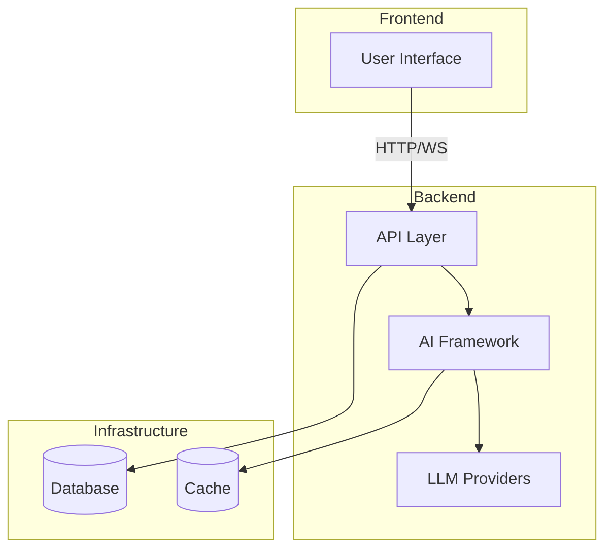

# AI-SDK-CREWAI

[](https://github.com/mk-knight23/AI-SDK-ECOSYSTEM)
[](https://github.com/joaomdmoura/crewAI)
[](https://react.dev/)
[](https://www.python.org/)

> **Framework**: CrewAI (Multi-Agent Orchestration)
> **Stack**: React 19 + FastAPI + CrewAI

---

## Overview

**AI-SDK-CREWAI** demonstrates production-ready multi-agent systems using CrewAI. It showcases role-based AI teams working together - Researcher, Writer, and Reviewer agents collaborating on complex tasks with persistent memory and multiple execution patterns.

### Key Features

- **Multi-Agent Crew Orchestration** - Coordinate specialized AI agents with distinct roles
- **Role-Based Agent Delegation** - Agents can delegate tasks to other specialists
- **Sequential & Hierarchical Patterns** - Execute tasks linearly or with manager delegation
- **Task Execution with Memory** - Persistent memory system for context tracking
- **Content Pipeline Workflow** - Pre-configured research → write → review pipeline
- **Real-time Monitoring** - Track agent activities and memory statistics
- **RESTful API** - Full FastAPI backend with comprehensive endpoints
- **Modern UI** - React 19 with shadcn/ui components

---

## Tech Stack

### Frontend
| Technology | Version | Purpose |
|-------------|---------|---------|
| React | 19 | UI framework |
| TypeScript | 5.x | Type safety |
| TailwindCSS | 3.4 | Styling |
| shadcn/ui | latest | Component library |
| Vite | latest | Build tool |

### Backend
| Technology | Version | Purpose |
|-------------|---------|---------|
| Python | 3.12 | Runtime |
| FastAPI | 0.115.0 | API framework |
| CrewAI | 0.28.0 | Agent orchestration |
| Pydantic | 2.9.0 | Data validation |
| Pytest | 8.3.0 | Testing |

---

## Quick Start

### Prerequisites
- Node.js 18+
- Python 3.12+
- OpenAI API key

### Backend Setup

```bash
cd backend

# Create virtual environment
python -m venv venv
source venv/bin/activate  # On Windows: venv\Scripts\activate

# Install dependencies
pip install -r requirements.txt

# Set environment variables
echo "OPENAI_API_KEY=your_key_here" > .env

# Run tests
pytest --cov=app --cov-report=html

# Start server
uvicorn app.main:app --reload --port 8000
```

### Frontend Setup

```bash
cd frontend

# Install dependencies
npm install

# Start development server
npm run dev

# Build for production
npm run build
```

The application will be available at:
- Frontend: http://localhost:3000
- Backend API: http://localhost:8000

---

## Architecture

### Multi-Agent System

The system includes 5 pre-configured agents:

| Agent | Role | Can Delegate |
|-------|------|--------------|
| **Researcher** | Conducts thorough research and gathers information | Yes |
| **Writer** | Creates engaging content from research | No |
| **Reviewer** | Reviews content for quality and accuracy | No |
| **Analyst** | Analyzes data and provides insights | Yes |
| **Planner** | Creates strategic plans and delegates tasks | Yes |

### Execution Patterns

1. **Single Task** - Assign one task to a specific agent
2. **Sequential** - Execute tasks one after another in order
3. **Hierarchical** - Manager agent delegates to specialists
4. **Content Pipeline** - Research → Write → Review workflow

### Memory System

- **Short-term Memory**: Tracks task execution context
- **Long-term Memory**: Persisted to disk for retrieval
- **Agent-specific**: Memory attributed to source agent
- **Task Association**: Memory linked to specific tasks

---

## API Endpoints

### Health & Configuration
- `GET /health` - Health check
- `GET /config` - Get current configuration

### Agents
- `GET /agents` - List all available agents
- `GET /agents/{name}` - Get agent information

### Task Execution
- `POST /tasks/execute` - Execute a single task
- `POST /tasks/sequential` - Execute tasks sequentially
- `POST /tasks/hierarchical` - Execute with hierarchical delegation
- `POST /tasks/content-pipeline` - Execute content pipeline

### Memory Management
- `POST /memory` - Add a memory entry
- `GET /memory` - Retrieve memories (with filters)
- `GET /memory/search` - Search memories
- `GET /memory/stats` - Get memory statistics
- `GET /memory/context/{task_id}` - Get task context
- `DELETE /memory` - Clear memories

### Crew Management
- `GET /crews/content-pipeline` - Get content pipeline crew
- `GET /crews/analysis` - Get analysis crew

---

## Usage Examples

### Execute Single Task

```typescript
const result = await api.executeTask({
  task: "Research the latest developments in quantum computing",
  agent: "researcher"
});
```

### Sequential Execution

```typescript
const result = await api.executeSequential({
  tasks: [
    "Research AI trends",
    "Write summary article",
    "Review for quality"
  ],
  agents: ["researcher", "writer", "reviewer"]
});
```

### Hierarchical Delegation

```typescript
const result = await api.executeHierarchical({
  manager: "planner",
  tasks: ["Analyze market data", "Create report"],
  assignments: {
    "analyze": "analyst",
    "create": "writer"
  }
});
```

### Content Pipeline

```typescript
const result = await api.executeContentPipeline({
  topic: "The Future of Renewable Energy"
});
```

---

## Project Structure

```
AI-SDK-CREWAI/
├── backend/
│   ├── app/
│   │   ├── main.py          # FastAPI application
│   │   ├── crews.py         # CrewAI orchestration
│   │   ├── memory.py        # Memory management
│   │   └── rag.py           # RAG integration (legacy)
│   ├── tests/
│   │   ├── test_main.py     # API tests
│   │   ├── test_crews.py    # Crew tests
│   │   └── test_memory.py   # Memory tests
│   ├── requirements.txt
│   └── pytest.ini
├── frontend/
│   ├── src/
│   │   ├── components/
│   │   │   └── ui/          # shadcn/ui components
│   │   ├── lib/
│   │   │   └── utils.ts     # API client
│   │   ├── App.tsx          # Main application
│   │   ├── main.tsx
│   │   └── index.css
│   ├── package.json
│   ├── tailwind.config.js
│   └── vite.config.ts
└── README.md
```

---

## Testing

The project follows TDD principles with 80%+ test coverage.

```bash
# Run all tests
pytest

# Run with coverage
pytest --cov=app --cov-report=html

# Run specific test file
pytest tests/test_crews.py

# Run with verbose output
pytest -v
```

---

## Environment Variables

| Variable | Description | Required |
|----------|-------------|----------|
| `OPENAI_API_KEY` | OpenAI API key for LLM | Yes |
| `SERPER_API_KEY` | API key for web search (optional) | No |

---

## Deployment

### Backend (Render/Railway)

1. Connect your repository
2. Set environment variables
3. Deploy with default settings

### Frontend (Netlify/Vercel)

```bash
# Build frontend
cd frontend
npm run build

# Deploy to Netlify
netlify deploy --prod --dir=dist
```

---

## Contributing

1. Fork the repository
2. Create a feature branch
3. Write tests for new functionality
4. Ensure all tests pass
5. Submit a pull request

---


---

## 🏗️ Architecture



---

## 📡 API Endpoints

| Method | Endpoint | Description |
|--------|----------|-------------|
| GET | /health | Health check |
| POST | /api/execute | Execute agent workflow |
| WS | /api/stream | WebSocket streaming |

---

## 🔧 Troubleshooting

### Common Issues

**Connection refused**
- Ensure backend is running
- Check port availability

**Authentication failures**
- Verify API keys in `.env`
- Check environment variables

**Rate limiting**
- Implement exponential backoff
- Reduce request frequency

---

## 📚 Additional Documentation

- [API Reference](docs/API.md) - Complete API documentation
- [Deployment Guide](docs/DEPLOYMENT.md) - Platform-specific deployment
- [Testing Guide](docs/TESTING.md) - Testing strategies and coverage

## License

MIT License - see [LICENSE](LICENSE) for details.

---

**Part of the [AI-SDK Ecosystem](https://github.com/mk-knight23/AI-SDK-ECOSYSTEM)**
